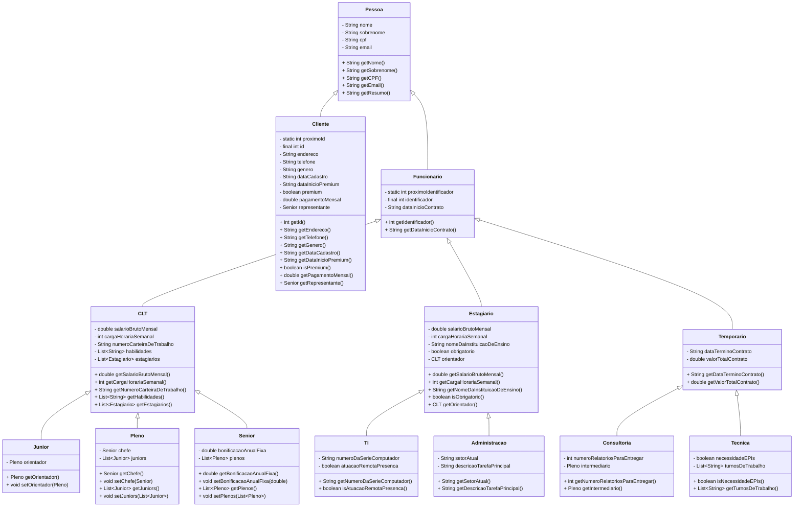

# Laboratório 4: Herança

## Engenharia de Telecomunicações - Prof. Sergio Prolo

## Programação Orientada a Objetos sergio.prolo@ifsc.edu.br

#### _07/06/2025_
#### _Aluno: Arthur Oliveira dos Reis_

---

### (i). Informações Gerais

- Coloque o diagrama de classes do readme.md do repositório.

- Organize as classes em pacotes da forma que lhe for conveniente, respeitando as regras de encapsulamento e modificadores de acesso (especialmente o protected).

- Na classe da aplicação (App.java), implemente um código que instancia diferentes objetos
da hierarquia de classes e testa suas funcionalidades.

## 1. Contexto

Você foi contratado para modelar parte do sistema de gestão de uma empresa de médio porte. A empresa deseja organizar informações sobre todas as pessoas com quem ela se relaciona. Cada pessoa tem informações básicas, incluindo ao menos nome, sobrenome, CPF e pelo menos um e-mail. Pessoas podem ser de duas categorias: funcionários e clientes

### 1.1 Clientes

Clientes devem registrar um id (int) único, endereço, telefone, gênero e data de cadastro. Alguns
clientes são classificados como clientes ‘premium’, que se diferenciam dos clientes comuns por causa
de um pagamento mensal, de uma data de início do período premium e de um vínculo direto com um
funcionário CLT Senior que age como seu representante na empresa.

### 1.2 Funcionários

Todo funcionário da empresa deve ter registrado seu identificador único (int) e a data do início do
seu contrato. Um funcionário pode ter um de três tipos de vínculos com a empresa: CLT, Estágio ou
Temporário.

#### 1.2.1 CLT

Funcionários CLT devem ter registro do seu salário bruto mensal, carga horária semanal, do
número da carteira de trabalho e um conjunto de habilidades (ex: "Java", "Office", "Django"). Os
funcionários CLT são categorizados em três níveis de senioridade: Sênior, Pleno ou Júnior. Todo CLT
Junior possui um orientador que deve ser CLT Pleno, e todo CLT Pleno pode orientar múltiplos CLT
Junior. De forma similar, todo CLT Pleno possui um chefe CLT Sênior, enquanto um CLT Sênior pode
chefiar múltiplos CLT Pleno. O CLT Sênior possui uma bonificação anual fixa que também precisa ser
registrada.

#### 1.2.2 Estágios

Estagiários devem ter registro do seu salário bruto mensal, carga horária semanal, o nome da sua instituição de ensino e se o estágio é obrigatório ou não. Todo estagiário deve ser orientado por um funcionário CLT da empresa, e um funcionário CLT pode orientar no máximo dois estagiários.
Estagiários são categorizados em dois tipos: TI ou Administração. Estagiários de TI devem registrar o número de série do computador em que eles trabalham e devem também registrar se a sua atuação é remota ou presencial. Estagiários de administração devem registrar o setor em que atual (ex: "Financeiro", "RH", "Compras") e uma descrição da sua principal tarefa.

#### 1.2.3 Temporários

Funcionários temporários devem registrar a data de término de contrato e valor total do contrato para realização do serviço. Os contrários temporários devem ser categorizados em 2 tipos: Consultoria ou Técnica. Como consultores geralmente atuam com entregas de relatórios específicos, eles devem ter um funcionário CLT Pleno que atue como seu intermediário, bem como o número de relatórios previstos para entregar até o fim do período contratual. Técnicos prestam serviços presenciais e contínuos, necessitando registrar o(s) turno(s) de trabalho (ex: manhã, noite) e a necessidade de EPIs.

## 2. Requisitos

- Crie as classes que você julgar necessárias para representar esse cenário.
- Utilize herança para evitar repetição de atributos e comportamentos.
- Implemente pelo menos um método `getResumo()` em cada classe, retornando uma descrição resumida do objeto.
- A estrutura de herança deve ser coerente e fazer sentido no mundo real.

## 3. Diagrama UML

